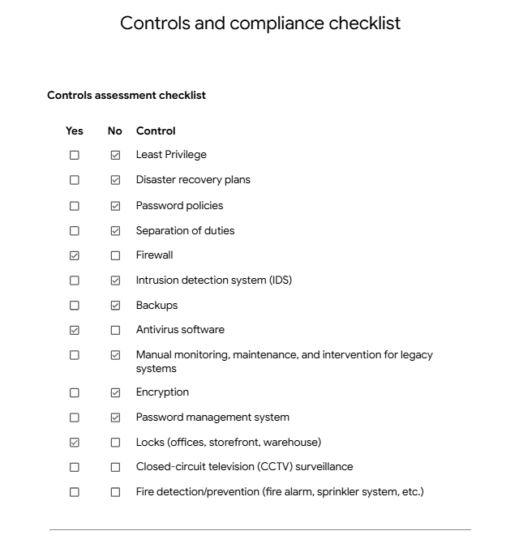
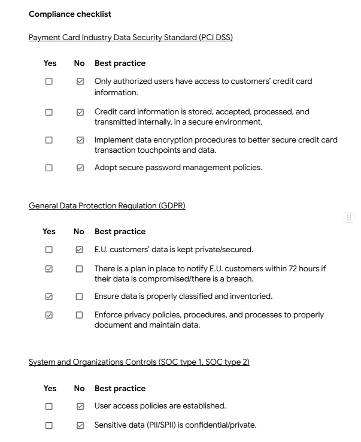
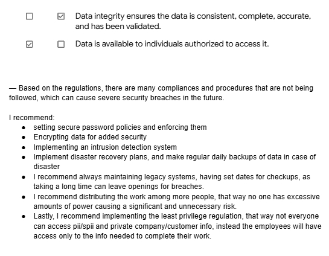

# 📋 Controls and Compliance Checklist

A cybersecurity controls assessment and compliance audit project completed as part of the Google Cybersecurity Professional Certificate.

## 📖 Project Overview

Conducted a security controls assessment and compliance audit for a fictional organization. Evaluated the presence (or absence) of critical security controls, reviewed alignment with major compliance frameworks, and provided professional recommendations to close security gaps.

## 🎯 Scenario

The organization needed a security posture review. My responsibilities included:

- Auditing existing security controls
- Identifying gaps in coverage
- Reviewing compliance with PCI DSS, GDPR, and SOC 1/2 frameworks
- Providing actionable recommendations to improve security posture

## 🛠️ Skills Demonstrated

- Security Controls Assessment
- Compliance Framework Knowledge (PCI DSS, GDPR, SOC 1/2)
- Risk Analysis
- Gap Identification
- Professional Recommendations
- GRC (Governance, Risk, Compliance) Fundamentals

## 📋 Part 1: Controls Assessment Checklist

Evaluated the organization for the presence of key security controls including:

- Least Privilege
- Disaster Recovery Plans
- Password Policies
- Separation of Duties
- Firewall
- Intrusion Detection System (IDS)
- Backups
- Antivirus Software
- Encryption
- Password Management System
- Physical Security (Locks, CCTV)
- Fire Detection / Prevention

## 📋 Part 2: Compliance Framework Review

Reviewed the organization's alignment with major compliance frameworks:

### 💳 PCI DSS (Payment Card Industry Data Security Standard)
Ensures credit card data is stored, processed, and transmitted securely.

### 🇪🇺 GDPR (General Data Protection Regulation)
Protects the privacy and personal data of EU citizens. Requires breach notification within 72 hours.

### 📊 SOC 1 / SOC 2 (System and Organization Controls)
Trust reports evaluating security, availability, processing integrity, confidentiality, and privacy of service organizations.

## 📋 Part 3: Recommendations

Based on the audit findings, provided the following recommendations:

- Implement secure password policies and enforcement
- Deploy encryption for sensitive data
- Implement an Intrusion Detection System (IDS)
- Establish disaster recovery plans and daily data backups
- Maintain legacy systems with scheduled checkups
- Distribute responsibilities to avoid excessive access concentration (Separation of Duties)
- Enforce the Principle of Least Privilege, restricting access to only what employees need

## 💡 Key Concepts Applied

- **Principle of Least Privilege** — restrict access to only what's needed
- **Defense in Depth** — layered security controls
- **Separation of Duties** — prevent excessive privilege
- **Compliance vs Security** — compliance is a baseline, not the ceiling
- **Risk Prioritization** — address highest-risk gaps first

## 🎓 Lessons Learned

- Compliance frameworks provide baseline security expectations, but true security requires going beyond compliance
- Documenting findings and recommendations is a critical GRC skill
- Different frameworks (PCI DSS, GDPR, SOC) address different aspects of security
- Physical security controls (locks, CCTV) are just as important as digital controls

## 📚 Certificate Context

This project was completed as part of the Google Cybersecurity Professional Certificate on Coursera, demonstrating practical application of security controls assessment and compliance auditing in a simulated enterprise environment.

## 👤 Author

Yorgo Albitar
Cybersecurity Student | Aspiring SOC 
